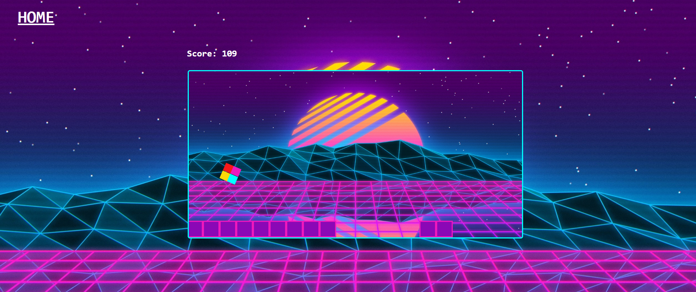

# The Possible Game - Final Project

## User Story

Have you ever found yourself bored out of your mind? Have some time to kill? Want to play a game that already exists only it's built in a native JavaScript environment using react? 

One of the most super addictive and exciting games you have ever experienced, based on the best-selling Xbox Live Indie Game, which was based on a very hard game-platform – The Possible Game. 

## Business Context

Gameplay is really simple and straightforward, it just consists of an automatically fast moving square through a level and while you make your square jump over smashing objects, the game becomes more and more exciting and interesting. The Possible Game is known as the “Insanely Addictive” side scrolling game. Each time you start the game you will experience something new, but if you are a person who is capable of beating the first level, you will get better. The Possible Game came out quite a while ago on the Xbox 360, now you are able to enjoy it on the iPhone as well and play it here on our site. Have fun and enjoy The Possible Game!

## Screenshot

## Deployed Link 

https://the-possible-game.netlify.com/

The backend is deployed on heroku for the user authentication and highscores data.

## Research
This game is based off of The Impossible Game. The Impossible Game is already popular with over 500k downloads and an average review score of 3.9/5 stars on the Google play store and is available on mobile, console, and PC. The Impossible Game is currently number 5 in the iOS store music app charts, number 2 featured app in the USA and Canada, and over 42k fans on Facebook. In conclusion, The Impossible Game sells for $.99 on multiple platforms, with a solid fan base that proves there is demand and a viable business for The Possible Game.

## Technology

MERN template from <a href="https://github.com/bcbrian">Brian Bartholomew</a> - authentication and database structures

Passport - user registration and authentication

Grommet - buttons, boxes, and inputs

React CSS Transition - animation

## Challenges

Building game logic, physics, and collision from scratch in react environment.

## Future Development

Performance optimization, adding more games to the website, adding more levels using tile mapping.

## Collaborators

<a href="https://github.com/binrz00">Brian Zauner</a>

<a href="https://github.com/Claudegarcia">Claudio Garcia</a>

<a href="https://github.com/samanthasengsouvanh">Samantha Sengsouvanh</a>

## License

This project is licensed under the MIT License - see the LICENSE.md file for details.
